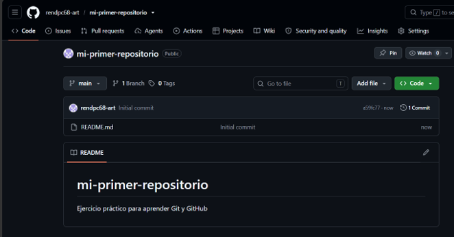
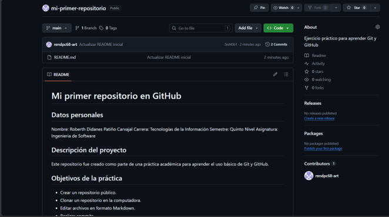
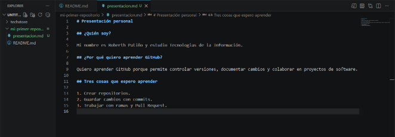

# Evidencias de la práctica

## Evidencia 1
Captura de la creación del repositorio.

## Evidencia 2
Captura del README actualizado.

## Evidencia 3
Captura del archivo presentacion.md.

## Evidencia 4
Captura de la rama creada.

## Evidencia 5
Captura del Pull Request.

